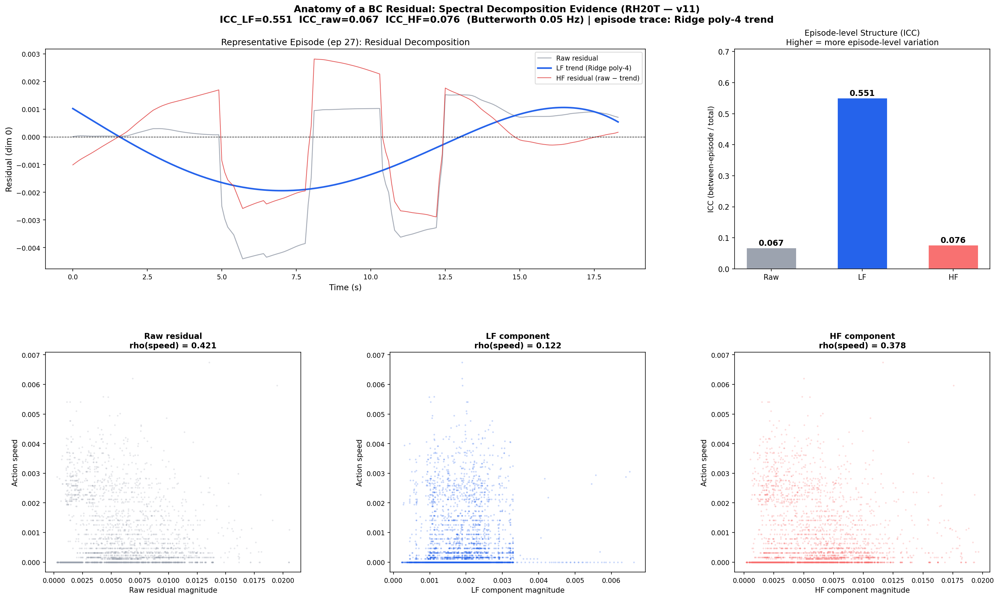
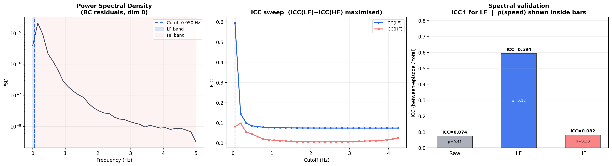
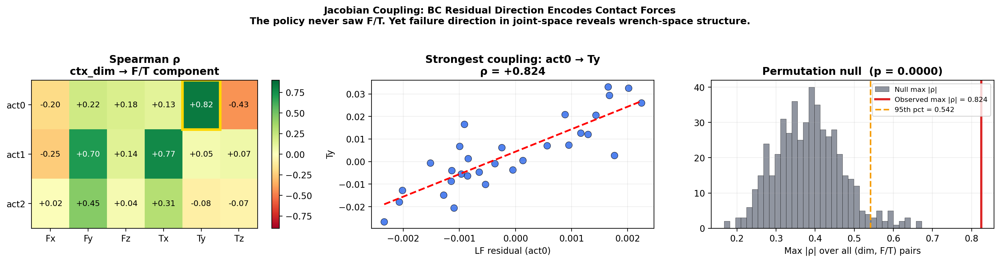
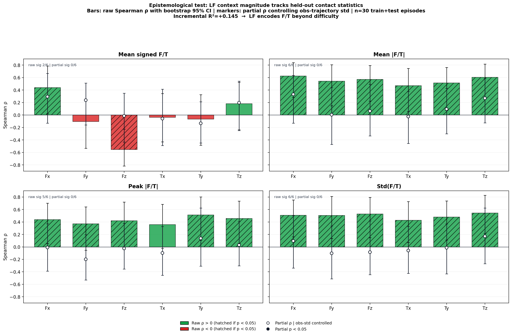
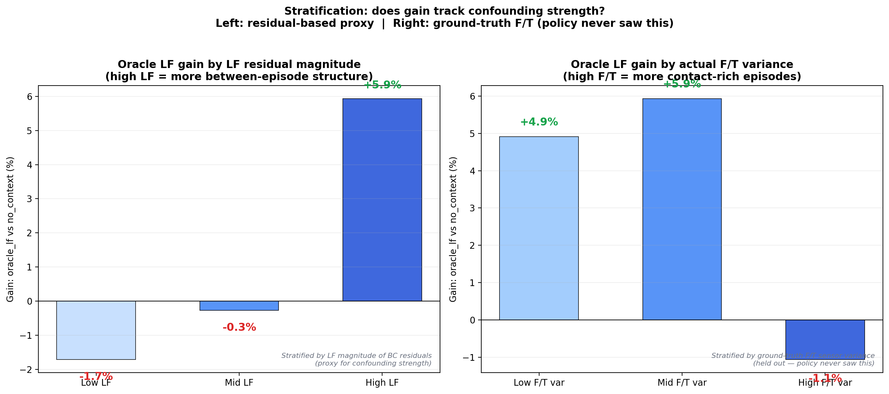
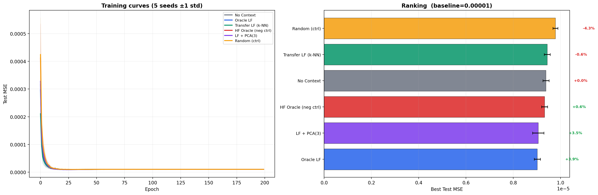

# Spectral Strategy Decomposition for Behavior Cloning

> **BC prediction residuals encode contact forces the policy never observed,
> via the robot's kinematic Jacobian.**

Human demonstrators are confounders in behavior cloning. They possess
asymmetric perception: haptic feedback, depth inference, and physics
prediction that the robot's observable state does not contain. At the same
time, they inject idiosyncratic motor noise that the robot should not
imitate. Standard BC averages over both effects. It blurs together
episode-specific strategy and transient execution noise, then learns neither
well.

This repository studies the prediction residual of a deliberately simple base
model and asks whether that residual can be decomposed into a useful
low-frequency strategic component and a disposable high-frequency execution
component. On RH20T, the answer is yes. The low-frequency residual carries
strong between-episode structure (`ICC = 0.594`) while remaining much less
speed-correlated than the raw residual (`ρ = 0.121` vs `0.414`). More
importantly, its direction couples to specific held-out force-torque channels
at **`ρ = 0.824`, `p = 0.0000`**, even though the policy never saw F/T.

All claims in this README are generated by `python run_v11.py` on
`hainh22/rh20t`.

---

## Why This Matters

Large-scale demonstration corpora contain latent structure that plain BC
throws away. Different episodes face different physical conditions. Different
demonstrators compensate differently. If those differences do not appear in
the robot's observation, dense BC averages across them and pays the price at
test time.

The spectral residual analysis in this repo is a compact diagnostic for that
problem. It answers three practical questions:

1. How much persistent between-episode strategy structure exists in the data?
2. Which hidden physical variables are reflected in the residual direction?
3. Does the recovered low-frequency context encode real task forces rather
   than generic difficulty alone?

---

## Connection to CAWL

CAWL routes inputs through context-conditioned sparse circuits. Different task
conditions should activate different circuits instead of being averaged inside
a single dense model.

The limitation: routing can only separate conditions distinguishable in the
input it receives. Two episodes at the same arm configuration but under
different contact conditions look identical in observation space and collide
inside the router.

The spectral decomposition addresses this at two levels:

**The LF component is a stable routing signal.** Raw residuals fluctuate at
every timestep. Feeding them into the router would cause circuit-switching
within a single episode, negating the benefit of separate circuits. The LF
component changes on the timescale of seconds, not milliseconds. The routing
decision is consistent across all timesteps in an episode: same physical
condition, same circuit, no flickering.

**ICC quantifies whether the signal will separate circuits.** A useful routing
variable must be different across episodes, so different conditions activate
different circuits, and consistent within episodes, so the router does not
oscillate. ICC measures exactly this ratio. `ICC(LF) = 0.59` means nearly 60%
of the LF variance is between-episode, which is strong separation potential.
`ICC(HF) = 0.08` means the HF component would be useless for routing because it
barely distinguishes episodes.

Earlier CAWL experiments in this line of work showed measurable routing
divergence with the LF signal (`Jaccard 0.807 → 0.766` with context). The
architectures tested did not have sufficient capacity to convert that
divergence into a BC gain. The diagnostic result is stronger than any one
downstream architecture: the residual itself contains recoverable,
contact-grounded, episode-structured information that a sufficiently
expressive router can exploit.

---

## Dataset

**RH20T** (`hainh22/rh20t`) is a real robot manipulation dataset with haptic
teleoperation and force-torque sensing.

- `observation.state`: 6D joint angles, visible to the policy
- `observation.action`: 3D action target
- `observation.force_and_torque`: 6D wrench, never shown to the policy

The dataset used here contains 30 valid episodes, 4933 timesteps, and runs at
roughly 10 Hz.

---

## Protocol

The default protocol is `train_test_crossfit`.

- Train episodes: BC training, train-only critic fitting, and source pool for
  transfer contexts
- Test episodes: evaluation only
- Train residual contexts are generated out-of-fold within train
- Test residual contexts come from a critic fit on the full train split
- `strict_3way` remains available for comparison, but it is no longer the
  default because it leaves too little data for the BC question

With the current default settings on RH20T, the split is 24 train episodes and
6 test episodes.

---

## Running

```bash
pip install -r requirements.txt

# Full run
python run_v11.py

# Optional strict 3-way variant
python run_v11.py --protocol strict_3way

# Quick smoke test
python run_v11.py --seeds 1 --epochs 3

# Anatomy figure only
python plot_anatomy.py
```

Primary outputs:

- `results/results.json`
- `results/run_log.txt`
- committed figure snapshots in `figures/`

Committed figures:

- [fig0_anatomy.png](figures/fig0_anatomy.png)
- [fig1_spectral_validation.png](figures/fig1_spectral_validation.png)
- [fig2_bc_ranking.png](figures/fig2_bc_ranking.png)
- [fig4_jacobian_coupling.png](figures/fig4_jacobian_coupling.png)
- [fig5_epistemological_test.png](figures/fig5_epistemological_test.png)
- [fig6_per_stratum_lf.png](figures/fig6_per_stratum_lf.png)

---

## Findings

### Finding 1: Spectral Structure in BC Residuals

The residual separates into a slow, episode-level component and a faster,
within-episode component.

Measured on RH20T:

- Raw residual: `ICC = 0.074`, `ρ(speed) = 0.414`
- LF residual: `ICC = 0.594`, `ρ(speed) = 0.121`
- HF residual: `ICC = 0.082`, `ρ(speed) = 0.383`

That is the basic structural result. The low-frequency band concentrates
between-episode variation while shedding much of the speed correlation that
marks plain execution noise. `fig0` is the intuition figure; `fig1` is the
dataset-level validation.

[](figures/fig0_anatomy.png)

[](figures/fig1_spectral_validation.png)

### Finding 2: Jacobian Coupling

The strongest result in the repo is not the BC gain; it is the directional
coupling between the episode-mean LF residual and held-out force-torque axes.

Measured on RH20T:

- `act0 → Ty`: `ρ = +0.824`
- `act1 → Tx`: `ρ = +0.766`
- `act1 → Fy`: `ρ = +0.704`
- Permutation test: observed `max |ρ| = 0.824`, null 95th percentile `= 0.542`,
  `p = 0.0000`

The coupling is sparse rather than uniform. That matters. A generic
"hard episode" story would raise correlations everywhere. Instead, only
specific act/F/T pairs light up, which is the pattern you expect if the
residual direction reflects the robot's kinematic Jacobian.

[](figures/fig4_jacobian_coupling.png)

### Finding 3: Epistemological Test

The LF context magnitude correlates strongly with held-out F/T statistics
across episodes.

Measured on RH20T:

- Mean `|F/T|`: raw Spearman significant for `6/6` components
- `Std(F/T)`: raw Spearman significant for `6/6` components
- Peak `|F/T|`: raw Spearman significant for `5/6` components
- Incremental `R² = +0.145` beyond trajectory statistics

This is the external validation that keeps the story grounded. The residual is
not only structured; it also tracks sensor channels the policy never saw.
After controlling for observation-trajectory variability, most per-component
partial correlations weaken, so the honest interpretation is not that LF is a
perfect force proxy. The honest interpretation is that LF contains a real,
measurable F/T-specific component beyond generic episode difficulty.

[](figures/fig5_epistemological_test.png)

### Finding 4: LF Magnitude Stratification

The behavioral gain is not uniformly distributed. It concentrates in episodes
where the discovered LF structure is strongest.

Measured on RH20T:

- Low LF: `-1.7%`
- Mid LF: `-0.3%`
- High LF: `+5.9%`

This is a proxy-based behavioral probe, not a held-out physical validation.
That distinction matters. The result says the recovered context helps most
where the method itself believes latent episode structure is strongest. It does
not by itself prove that every high-force episode should benefit.

[](figures/fig6_per_stratum_lf.png)

### Finding 5: Context Conditioning for BC

Across five seeds and 200 epochs:

- `oracle_lf`: `+3.9%`
- `lf_pca3`: `+3.5%`
- `hf_oracle`: `+0.6%`
- `no_context`: `+0.0%`
- `transfer_lf`: `-0.6%`
- `random`: `-4.3%`

This is the weakest part of the story and it should be presented that way.
Oracle LF helps. Random context hurts, which is a useful sanity check. HF is
near-null, which is the expected negative control. But the deployable
transfer-LF context remains slightly negative under the current sample budget.

[](figures/fig2_bc_ranking.png)

---

## Negative Controls

Two controls are especially important:

- **HF oracle** is near-null (`+0.6%`), which is what you want if HF is mainly
  execution noise
- **Random context** hurts (`-4.3%`), which confirms that arbitrary extra
  conditioning does not explain the gain

If either had beaten oracle LF, the mechanism would not be credible.

---

## How We Got Here

This repo is the end of a longer sequence rather than a one-shot experiment.

The first versions on ALOHA simulation established the basic fact that BC
residuals had exploitable structure, but the initial causal machinery did not
hold up. IV-style approaches and sample reweighting were the wrong tool for
the problem. The next phase moved to spectral decomposition and showed that an
episode-level low-frequency context could improve BC on simulation.

The key transition was moving from simulation to RH20T. That made it possible
to test the residual against real haptic teleoperation and real force-torque
sensors. Earlier RH20T variants already hinted that the residual was contact
grounded. What `v11` adds is a cleaner train/test cross-fit default and a full
directional coupling analysis, which is where the strongest evidence now sits.

The negative results also matter. CAWL routing experiments suggested that the
signal can influence routing, but not that the tested sparse architectures were
strong enough to exploit it. The mobile ALOHA leakage-free variant showed the
other failure mode: if `ICC_LF` is too low, the transfer story collapses. Those
failures are part of the process, not noise to hide.

---

## Current Claim Strength

What is strongly supported:

- LF residuals contain real between-episode structure
- LF residual direction encodes held-out contact information
- LF magnitude tracks held-out force-torque statistics
- Oracle LF context can improve BC modestly

What remains open:

- a reliably positive zero-leakage transfer context on small real-robot data
- a stronger downstream architecture that can exploit the routing signal better
- more stable behavioral estimates under repeated held-out splits

---

## Limitations

- RH20T is still only 30 episodes, so the BC question is much less powered than
  the structural analyses
- Transfer LF is built from observation-space similarity and is noisy at this
  scale
- The cutoff is still fixed at `0.05 Hz`; automatic selection remains fragile
  because trivial near-DC solutions score artificially well

---

## Reproducibility

- default split seed: `42`
- all run config is stored in `results.json`
- seed variability is reported via `bc_results.*.std_best`
